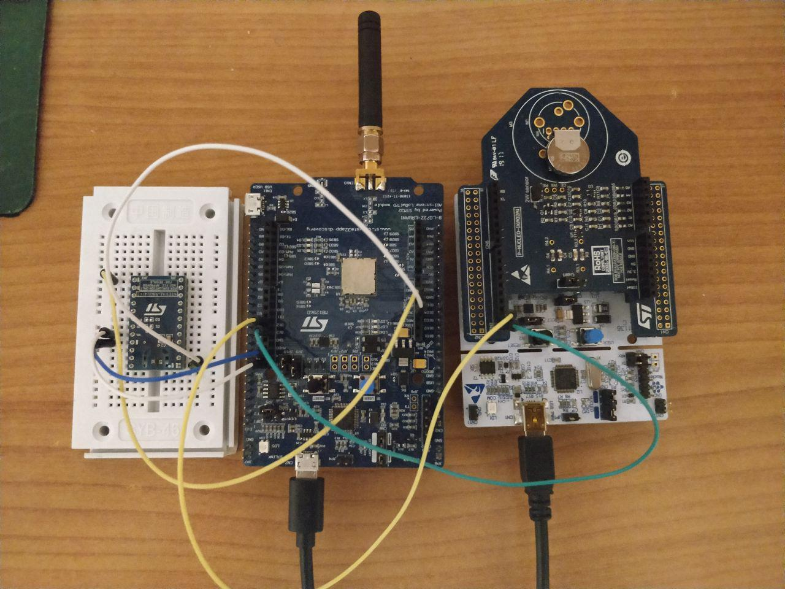

# Air Quality Monitoring
This repository contains the code used in the Air Quality Monitoring project presented on: 
* [Hackster](https://www.hackster.io/151578/air-quality-monitoring-b48e9e) 
* SlideShare:
	* [Concept and Technologies](https://www.slideshare.net/MattiaNicolella/air-quality-monitoring-137482560)
	* [Realization]()

# Architecture

# Specifications

### uTensor
The folder called [benzene_predictor](https://github.com/antoninus96/Air_Quality_Monitoring_IoT/tree/master/benzene_predictor) contains the code that we used to create a Perceptron based predictor of benzene levels, given the values of temperature, relative humidity and carbon monoxide.

This code was compiled using the Mbed cli and following the specification in the [uTensor](https://github.com/uTensor/uTensor/tree/master) official repository and is functional on Mbed OS v5.11.5 while has some compilation errors in the version 5.12.
Due to the consistent binary dimension this code cannot be used on the DISCO-L072CZ-LRWAN1 board, but it works well on the NUCLEO-F401RE board.

### P-NUCLEO-IKA02A1
The folder called P-NUCLEO-IKA02A1 contains the code used to test the P-NUCLEO-IKA02A1 carbon monoxide sensor, which is not compatible with the DISCO-L072CZ-LRWAN1 board due to the lack of the A2, A3 and A5 analog pins; however this code works on the NUCLEO-F401RE board but it has some unspecified pin conflicts since the sensor stops working when other digital pins are used (eg. D14 and D15).

### STEVAL-MKI141V2
The folder called STEVAL-MKI141V2 contains the code used to test the humidity and temperature on environment. It is connected directly with Lora to upload the data on cloud. The sensor is powered with 3.3V and uses the SDA and SCL pins, respectively, for data transmission and clock. As can be seen from the code, once the sensor is started, it is possible to receive data using the **get_temperature()** and **get_humidity()** functions.

### Web Data Connector from InfluxDB to Tableau
The folder called WDC_Influx contains the two files (HTML and Javascript) that allow to create the bidirectional channel between InfluxDB and Tableau. It uses the [Tableau libraries](https://connectors.tableau.com/libs/tableauwdc-2.3.latest.js), the first step is to receive the list of tables stored on InfluxDB, after the selection, its schema is loaded into Tableau.

# Authors
* Linkedin:
	* [Antonio Di Maggio](www.linkedin.com/in/antonino-di-maggio-216479143/)
	* [Mattia Nicolella](https://www.linkedin.com/in/mattianicolella/)
	* [Leonardo Salvucci](https://www.linkedin.com/in/leonardo-salvucci/)
